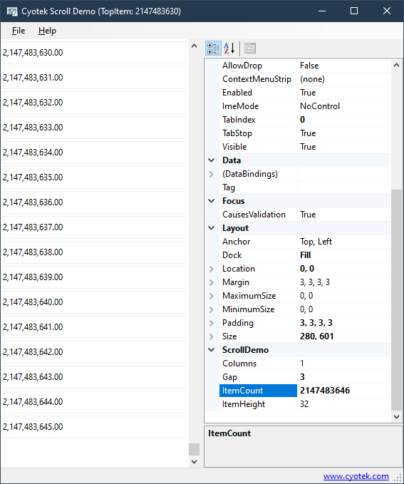

# Creating a custom single-axis scrolling control in WinForms

This repository contains a sample application demonstrating how
to create a custom control that scrolls on a single axis.

For more information, please see the following article on the
Cyotek blog:

* [Creating a custom single-axis scrolling control in WinForms](https://www.cyotek.com/blog/creating-a-custom-single-axis-scrolling-control-in-winforms)
